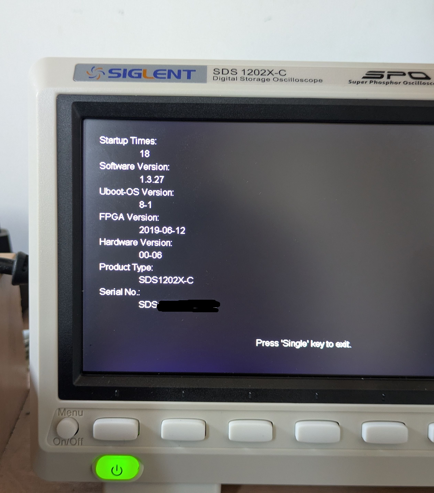

# sds1000X-minihack

Приехал вариант осциллографа sds1202x-c.
Многие надписи иероглифами. Переключения языка нет.


Подобную проблему обсуждали на [EEVblog SIGLENT SDS1102X-C, supported languages issue](https://www.eevblog.com/forum/testgear/siglent-sds1102x-c-supported-languages-issue/).

Подмена sys_cfg.cfg могла привести к проблемам.
Например, установка прошивки SDS1002X-E_1.3.17R1_EN.zip приводит к исчезновению развертки и т.д.

## Подключение через UART

Плата sds1202x-c 
мало отличается от [sds1202x-e](https://github.com/360nosc0pe/siglent_hardware/tree/master/sds1202xe).

1. Распаиваем разъем uart и подключаем адаптер usb-uart (__сигналы 3.3V!!__).
2. Подключаемся через терминал, включаем осциллограф.
3. Дожидаемся полной загрузки.
4. На флешку копируем скрипты и подключаем ее к осциллографу.
5. Выполняем команды:
```
 cd /usr/bin/siglent/usr/mass_storage/U-disk0
 ./change_lang.sh
 ./add_telnetd.sh
 reboot
```
6. Проверяем процессы:
```
/usr/bin/siglent # pstree
linuxrc-+-ash---pstree
        |-portmap
        |-sds1000b.app_---23*[{sds1000b.app_}]
        `-telnetd
```
## Результат


```
Pros:
- локализация
- запуск telnetd и lighttpd
- можно снять все дампы
Cons:
- снятие гарантии производителя
```


